### hi , Im addicted to LLMs

### what i'm building

**🧾 the korg stack — verifiable AI**
- **[korg](https://github.com/New1Direction/korg)** · [live](https://yvaehkorg.lol) — the runtime + ledger that makes an agent's every move provable
- **[korgex](https://github.com/New1Direction/korgex)** · [docs](https://korgex-docs.pages.dev) — an AI coding agent that works with any model and keeps the receipts
- **[korgchat](https://github.com/New1Direction/korgchat)** — chat where every message is a checkable ledger event
- **[thumper](https://github.com/New1Direction/thumper)** — the fast layer under korgex: runs code in seconds and heals its own errors

**🔍 My Other Ideas*
- **[coherence-auditor](https://github.com/New1Direction/coherence-auditor)** — catches an AI contradicting its own stated odds and prices the slip as a guaranteed-loss bet
- **[psd-common-sense](https://github.com/New1Direction/psd-common-sense)** — a safety layer that vets an agent's actions before they happen
- **[webmcp-anything](https://github.com/New1Direction/webmcp-anything)** — turn any URL into agent-callable MCP tools
- **[ningen-shikkaku](https://github.com/New1Direction/ningen-shikkaku)** — secrets that live only as long as your session does
- **[SKTPG](https://github.com/New1Direction/SKTPG)** — directional intelligence: skate where the puck is going
- **[pretexter](https://github.com/New1Direction/pretexter)** — makes AI agents experts at @chenglou/pretext
- **[pi-platform](https://github.com/New1Direction/pi-platform)** — a deterministic semantic execution fabric with governance layers

📖 each project's full docs live in its README — click through for the deep dive.

---

<picture>
  <source media="(prefers-color-scheme: dark)" srcset="https://raw.githubusercontent.com/New1Direction/New1Direction/output/github-contribution-grid-snake-dark.svg">
  <source media="(prefers-color-scheme: light)" srcset="https://raw.githubusercontent.com/New1Direction/New1Direction/output/github-contribution-grid-snake.svg">
  
</picture>
